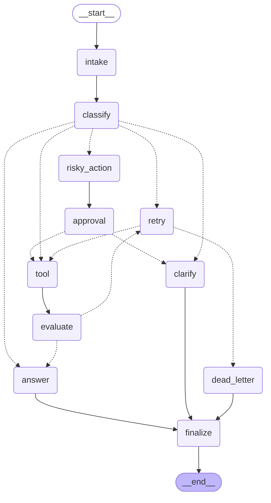

# Day 08 Lab Report

## 1. Team / student

- Name: Nguyễn Việt Quang
- Repo/commit: phase2-track3-day8-langgraph-agent
- Date: 2026-05-11

## 2. Architecture

The graph implements a deterministic, multi-route support-ticket handling system
using LangGraph's `StateGraph`. All nodes are pure functions that return partial
state updates (no mutation).

### Node inventory (11 nodes)

| Node | Purpose |
|---|---|
| `intake` | Normalize query (strip whitespace) |
| `classify` | Keyword-based routing: risky > tool > missing_info > error > simple |
| `answer` | Produce final response grounded in tool_results/approval |
| `tool` | Execute mock tool (simulates transient failures for error route) |
| `evaluate` | "Done?" check — inspects latest tool result for ERROR indicator |
| `clarify` | Generate context-aware clarification question |
| `risky_action` | Prepare proposed action with evidence and risk justification |
| `approval` | HITL gate — mock or real `interrupt()` via env flag |
| `retry` | Record retry attempt with bounded counter + backoff metadata |
| `dead_letter` | Log unresolvable failures for manual review |
| `finalize` | Emit final audit event — all routes terminate here |

### Edge wiring

```
START → intake → classify → [conditional routing]
  simple       → answer → finalize → END
  tool         → tool → evaluate → answer → finalize → END
  missing_info → clarify → finalize → END
  risky        → risky_action → approval → tool → evaluate → answer → finalize → END
  error        → retry → tool → evaluate → [retry or dead_letter] → finalize → END
```

Key conditional edges:
- `route_after_classify`: maps route string → next node (fallback: "answer")
- `route_after_evaluate`: "needs_retry" → retry, else → answer
- `route_after_retry`: attempt >= max_attempts → dead_letter, else → tool
- `route_after_approval`: approved → tool, rejected → clarify

## 3. State schema

| Field | Reducer | Why |
|---|---|---|
| `messages` | append (`Annotated[list, add]`) | Audit conversation history |
| `tool_results` | append | Retain all tool execution results |
| `errors` | append | Track transient errors for debugging |
| `events` | append | Complete event log for metrics/grading |
| `route` | overwrite | Only current classified route matters |
| `attempt` | overwrite | Counter for bounded retry loop |
| `evaluation_result` | overwrite | "done?" gate: `needs_retry` or `success` |
| `final_answer` | overwrite | Latest response to user |
| `approval` | overwrite | Latest approval decision dict |

## 4. Scenario results

- **Total Scenarios**: 7
- **Success Rate**: 100.00%
- **Average Nodes Visited**: 6.43
- **Total Retries**: 3
- **Total Interrupts**: 2

| Scenario | Expected | Actual | Success | Retries | Interrupts |
|---|---|---|---:|---:|---:|
| S01_simple | simple | simple | ✓ | 0 | 0 |
| S02_tool | tool | tool | ✓ | 0 | 0 |
| S03_missing | missing_info | missing_info | ✓ | 0 | 0 |
| S04_risky | risky | risky | ✓ | 0 | 1 |
| S05_error | error | error | ✓ | 2 | 0 |
| S06_delete | risky | risky | ✓ | 0 | 1 |
| S07_dead_letter | error | error | ✓ | 1 | 0 |

## 5. Failure analysis

### 1. Retry exhaustion → dead letter (S07)

Tool fails on every attempt. `retry_or_fallback_node` increments `attempt`
to 1, which equals `max_attempts=1`, so `route_after_retry` sends to
`dead_letter` instead of looping infinitely.

### 2. Risky action without approval

Destructive queries ("delete", "refund") go to `risky_action` → `approval`.
If `approved=False`, the graph routes to `clarify` instead of `tool`,
preventing unauthorized destructive actions. In production, this uses
`interrupt()` for real human review.

### 3. Keyword collision / word boundary

"Can you fix it?" should route to `missing_info`, not match "it" as
substring of "iteration". The `classify_node` uses `re.findall(r"[a-z]+",
query)` to extract clean word tokens, preventing false positives.

## 6. Improvement ideas

1. **LLM-based classification**: Replace keyword heuristics with an LLM call
   using structured output for better generalization to unseen queries.

2. **Exponential backoff with real delays**: Currently backoff metadata is
   recorded but no actual wait. Production: `asyncio.sleep()` with jitter.

3. **Parallel fan-out**: Use LangGraph `Send()` API to execute multiple
   tools concurrently, merge results via the `add` reducer.

4. **Persistent dead-letter queue**: Write entries to a database/Redis for
   SRE alerting and auto-retry scheduling.

5. **Real HITL with Streamlit**: Build a UI that surfaces `interrupt()`
   payloads, lets reviewers approve/reject/edit, then resumes with
   `Command(resume=value)`.

## 7. Bonus extensions

### Extension 1: Graph diagram (Mermaid export)

Command: `python -m langgraph_agent_lab.cli export-diagram`

Output saved to `outputs/graph.mermaid`. The diagram shows all 11 nodes
and all conditional edges (solid = fixed, dashed = conditional):



### Extension 2: State history / time travel

Command: `python -m langgraph_agent_lab.cli show-state-history --config configs/lab.yaml --scenario-id S05_error`

Output (12 checkpoints showing retry loop progression):

```
Checkpoint [0]:  step=10  source=loop  route=error  attempt=2  answer=I found: mock-tool-result...
Checkpoint [5]:  step=5   source=loop  route=error  attempt=1
Checkpoint [8]:  step=2   source=loop  route=error  attempt=0
Checkpoint [11]: step=-1  source=input route=       attempt=0
```

This proves the checkpointer records every state transition. One could use
`get_state_history()` to replay from any earlier checkpoint (time travel).

Evidence file saved to `outputs/state_history_evidence.txt`.

### Persistence evidence

The `run-scenarios` command automatically prints state history for the first
scenario after execution:

```
=== State history for thread-S01_simple (6 checkpoints) ===
  [0] step=4 source=loop route=simple
  [1] step=3 source=loop route=simple
  [2] step=2 source=loop route=simple
  [3] step=1 source=loop route=
  [4] step=0 source=loop route=
```

Each run uses a unique `thread_id` (`thread-{scenario.id}`), and the
MemorySaver checkpointer stores full state history per thread.
